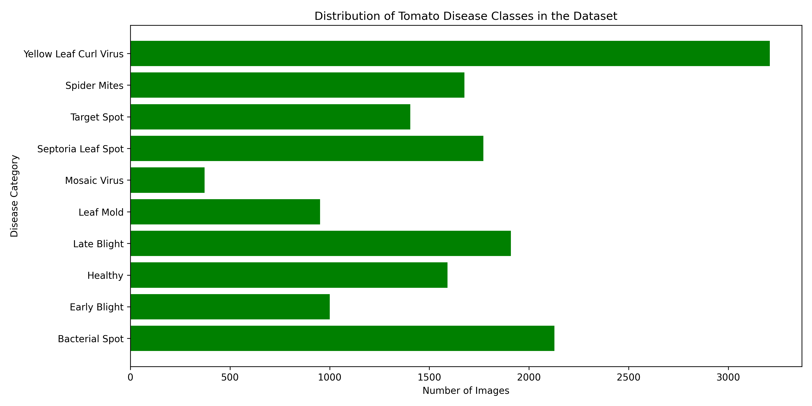
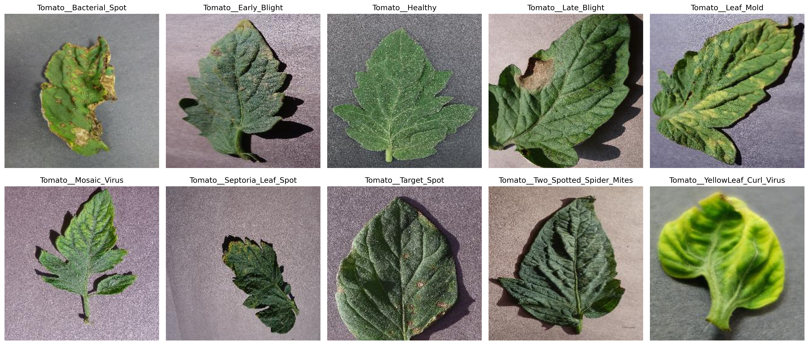
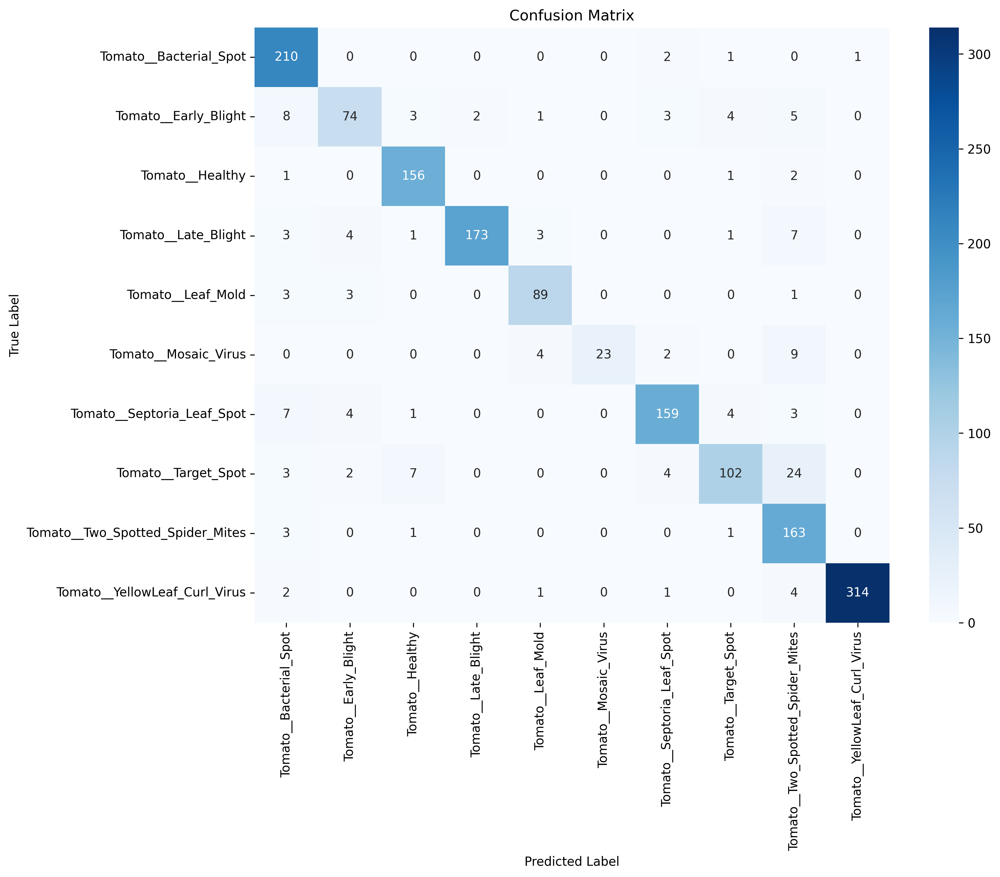
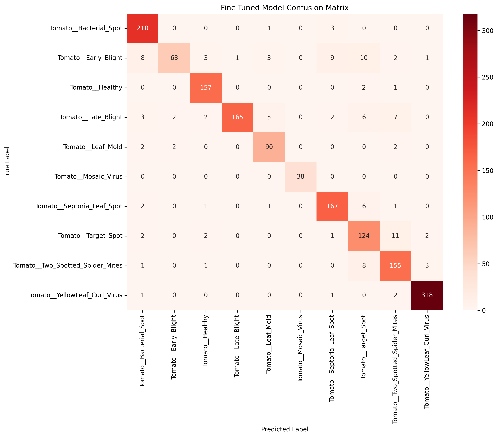

# 🍅 Tomato Plant Disease Detection using Deep Learning

## 📖 Introduction

Tomato Plant Disease Detection is an end-to-end Deep Learning and Computer Vision project designed to automatically identify diseases from tomato leaf images. The system utilizes Transfer Learning with MobileNetV2 and achieves a test accuracy of **92.36%** on the PlantVillage Tomato Dataset.

The project includes:

* Data Collection and Analysis
* Data Preprocessing and Augmentation
* Transfer Learning with MobileNetV2
* Model Fine-Tuning
* Model Evaluation and Performance Analysis
* Streamlit Web Application Deployment

The final application allows users to upload a tomato leaf image and receive an instant disease prediction along with confidence scores.

---

# Project Objectives

* Detect tomato leaf diseases automatically from images.
* Reduce dependency on manual disease inspection.
* Demonstrate practical application of Deep Learning in agriculture.
* Learn the complete Machine Learning project lifecycle.
* Build an industry-grade Computer Vision project.

---

# Dataset Information

## Dataset

PlantVillage Tomato Dataset

## Crop Type

Tomato

## Total Classes

10

## Total Images

16,011

## Disease Categories

| Class Name                       |
| -------------------------------- |
| Tomato__Bacterial_Spot           |
| Tomato__Early_Blight             |
| Tomato__Healthy                  |
| Tomato__Late_Blight              |
| Tomato__Leaf_Mold                |
| Tomato__Mosaic_Virus             |
| Tomato__Septoria_Leaf_Spot       |
| Tomato__Target_Spot              |
| Tomato__Two_Spotted_Spider_Mites |
| Tomato__YellowLeaf_Curl_Virus    |



## Sample Preview


---

# Model Information

## Base Model

MobileNetV2

## Transfer Learning

ImageNet Pretrained Weights

## Input Size

224 × 224 × 3

## Framework

TensorFlow / Keras

## Training Strategy

### Phase 1

Feature Extraction

* MobileNetV2 Frozen
* Custom Classification Head Trained

### Phase 2

Fine-Tuning

* Upper MobileNetV2 Layers Unfrozen
* Low Learning Rate Training

---

# 📈 Model Performance

## Feature Extraction Model

| Metric        | Value  |
| ------------- | ------ |
| Test Accuracy | 90.87% |
| Test Loss     | 0.2754 |

## Confusion Matrix 



## Fine-Tuned Model

| Metric        | Value  |
| ------------- | ------ |
| Test Accuracy | 92.36% |
| Test Loss     | 0.2283 |

## Confusion Matrix for Fine-Tuned Model


Final deployed model:

**Fine-Tuned MobileNetV2**

---

# Project Pipeline

```text
PlantVillage Dataset
          │
          ▼
Exploratory Data Analysis
          │
          ▼
Data Visualization
          │
          ▼
Train / Validation / Test Split
          │
          ▼
Data Augmentation
          │
          ▼
Transfer Learning (MobileNetV2)
          │
          ▼
Feature Extraction Training
          │
          ▼
Model Evaluation
          |
          ▼
Fine-Tuning Model
          │
          ▼
Fine-Tuned Model Evaluation
          │
          ▼
Model Export
          │
          ▼
Streamlit Application
          │
          ▼
Deployment on Streamlit Cloud
```

---

# Project Folder Structure

```text
Tomato-Plant-Disease-Detection/
│
├── app/
│   └── app.py
│
├── dataset/
│   ├── train/
│   ├── valid/
│   └── test/
│
├── model/
│   ├── final_tomato_disease_model.keras
│   └── class_names.json
│
├── notebooks/
│   ├── training_notebook.ipynb
|   ├── dataset_analysis.ipynb
|   ├── dataset_split.ipynb
|   └── sample_visualization.ipynb
│
├── screenshots/
│
├── requirements.txt
│
├── README.md
│
└── .gitignore
```

---

# Development Environment

## Operating System

Windows 10 Pro

## IDE

Visual Studio Code

## Python Version

```bash
Python 3.13
```

## Package Manager

```bash
uv
```

## Google Colab
```
Add Colab extension in VS Code
```

---

# Dependencies

```text
tensorflow-cpu
streamlit
numpy
pillow
matplotlib
seaborn
scikit-learn
pandas
jupyter
notebook
```

---

# Installation Guide

## Method 1: Using UV (Recommended)

### Clone Repository

```bash
git clone https://github.com/your_username/Tomato-Plant-Disease-Detection.git

cd Tomato-Plant-Disease-Detection
```

### Create Virtual Environment

```bash
uv venv --python 3.13
```

### Activate Environment

#### Windows

```bash
.venv\Scripts\activate
```

#### Linux / Mac

```bash
source .venv/bin/activate
```

### Install Dependencies

```bash
uv pip install -r requirements.txt
```

---

# Installation Using Pip

### Create Virtual Environment

```bash
python -m venv .venv
```

### Activate Environment

#### Windows

```bash
.venv\Scripts\activate
```

#### Linux / Mac

```bash
source .venv/bin/activate
```

### Install Requirements

```bash
pip install -r requirements.txt
```

---

# Running the Streamlit Application

Navigate to the project directory:

```bash
cd Tomato-Plant-Disease-Detection
```

Run:

```bash
streamlit run app/app.py
```

Application will be available at:

```text
http://localhost:8501
```

---

# Application Features

* Upload Tomato Leaf Image
* Automatic Disease Detection
* Confidence Score Display
* Top Predictions Display
* Disease Information Section
* Real-Time Inference

---

# Evaluation Metrics

The model was evaluated using:

* Accuracy
* Precision
* Recall
* F1 Score
* Confusion Matrix
* Classification Report

---

# Transfer Learning Architecture

```text
Input Image (224x224x3)
     │
     ▼
Data Augmentation
     │
     ▼
MobileNetV2
(ImageNet Weights)
     │
     ▼
Global Average Pooling
     │
     ▼
Dense Layer (128 Neurons)
     │
     ▼
Dropout (0.3)
     |
     ▼
Dense Layer (10 Neurons)
     │
     ▼
Softmax
     |
     ▼
Output Layer (10 Classes)


```

---

# Future Improvements

* Multi-Crop Disease Detection
* Disease Severity Classification
* Treatment Recommendation System
* Mobile Application Development
* REST API Deployment
* Cloud-Based Inference

---

# Author

### Surojit Jana

B.Tech – Computer Science & Engineering

Government College of Engineering and Leather Technology

---

# License

This project is developed for educational and research purposes.

